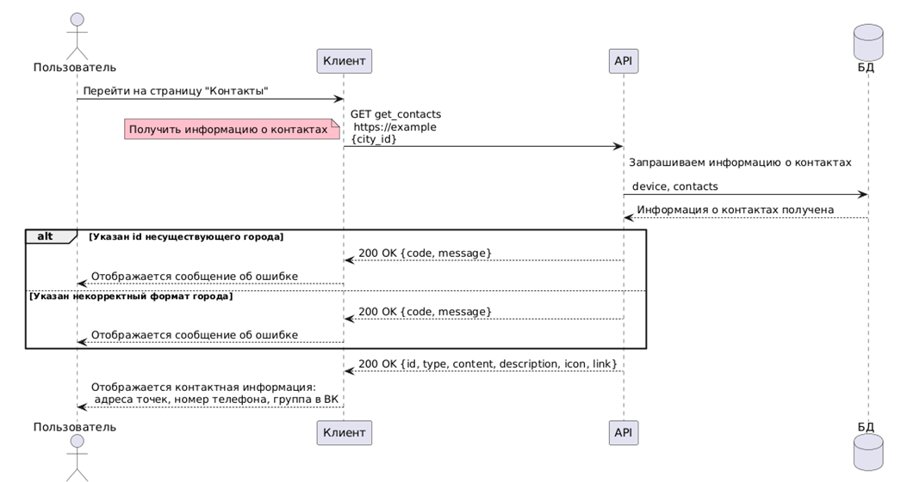
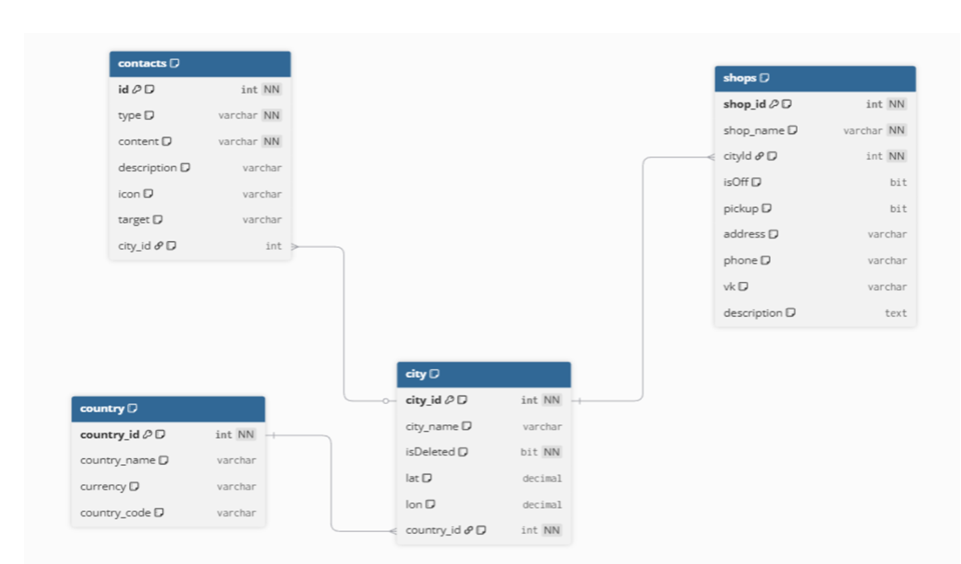

# Блок: Contacts

_Автоматически обновлено: 06.06.2026 19:51_

## Пользовательские сценарии

| Сценарий | Роль | Шаги |
| :--- | :--- | :--- |
| Просмотр контактной информации | Пользователь | Переходит на страницу «Контакты» → Отображается информация |
| Звонок в поддержку | Пользователь (приложение) | Нажимает на номер → Открывается приложение «Телефон» |
| Переход в ВКонтакте (без приложения) | Пользователь | Нажимает на ссылку → Открывается браузер |
| Переход в ВКонтакте (приложение установлено) | Пользователь (приложение) | Нажимает на ссылку → Открывается приложение ВКонтакте |

---

---

## Диаграммы

Диаграмма последовательностей  

ER-диаграмма  

---

---

## База данных

### Таблица `contacts`

**Назначение:** Хранит контактную информацию сервиса

**Связи:** city_id → city.city_id

**Применение:** Страница «Контакты»; API-метод: GET /api/contacts

| Название параметра | Тип данных | Может быть пустым? | Назначение | Пример |
| :--- | :--- | :---: | :--- | :--- |
| id | integer | нет | _Требует описания_ | _Требует примера_ |
| type | character varying | нет | _Требует описания_ | _Требует примера_ |
| content | character varying | нет | _Требует описания_ | _Требует примера_ |
| description | character varying | да | _Требует описания_ | _Требует примера_ |
| icon | character varying | да | _Требует описания_ | _Требует примера_ |
| target | character varying | да | _Требует описания_ | _Требует примера_ |
| city_id | integer | да | _Требует описания_ | _Требует примера_ |

## API-методы

### `GET /api/contacts`

**Назначение:** Получить контактную информацию сервиса для указанного города

**Авторизация:** Не требуется

**Применение:** Страница «Контакты»

**Таблицы БД:** contacts, city

**Входные параметры:**

| № | Название | Где | Тип | Обязателен? | Формат | Пример |
| --- | --- | --- | --- | --- | --- | --- |
| 1 | city_id | body | string | да | число | 1 |
| 2 | platform | headers | string | да | число: 1 — iOS, 2 — Android, 3 — Web | 1 |
| 3 | device_token | headers | string | да | UUID | token1234 |

**Карта ответов:**

| Код | Условие | Формат | Описание |
| --- | --- | --- | --- |
| 200 | Город найден, контакты получены | JSON | Массив объектов контактной информации |
| 200 | Несуществующий идентификатор города | JSON | ResponseCode: 3 — такого города нет |
| 200 | Некорректный формат идентификатора | JSON | ResponseCode: 2 — неверно указан город |

**Поля ответа:**

| № | Название | Тип | Обязателен? | Назначение | Пример |
| --- | --- | --- | --- | --- | --- |
| 1 | id | string | да | Идентификатор контакта | 1 |
| 2 | type | string | да | Тип контакта: phone, address, vk | phone |
| 3 | content | string | да | Содержимое контакта | +7 (999) 123-45-67 |
| 4 | description | string | нет | Дополнительное описание | null |
| 5 | icon | string | да | Название файла иконки | phone.png |
| 6 | target | string | да | Ссылка для перехода или номер телефона | +79991234567 |
| 7 | ResponseMessage | string | да | Текст сообщения об ошибке | Такого города нет |

